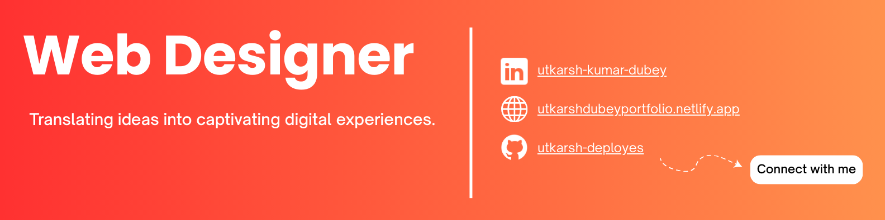

## Hello World, I'm Utkarsh👋

### About Me  
I am a **MERN Stack Developer, AWS Cloud Practitioner, and AI/ML Enthusiast** with a strong focus on **building scalable web applications** and **cloud-based solutions**. Currently exploring **Microservices and DevOps** to enhance backend efficiency.  

- **B.Tech in Computer Science (E-Commerce Technology)**
- **Co-Founder of WebLab** | A Web Development Agency  
- Passionate about **Full-Stack Development, Data and Cloud Computing**  

---

### Tech Stack  

**Frontend:** HTML, React.js, Next.js, Tailwind CSS  
**Backend:** Node.js, Express.js  
**Databases:** MongoDB, MySQL  
**Cloud & DevOps:** AWS (EC2, S3, Lambda), CI/CD Pipelines  
**Languages:** C++, Python  
**Other Tools:** Git, GitHub, Firebase, Stripe API  

---

### Open to Collaborations & Innovative Ideas  

I am always eager to **collaborate on impactful projects, brainstorm innovative solutions, and build something extraordinary.** Whether it’s a **cutting-edge web application, cloud-driven architecture, AI/ML integration, or a bold new startup idea**, I am open to exploring possibilities and bringing ideas to life.  

If you have an **exciting project, a groundbreaking concept, or just a spark of an idea**, let’s connect and make it happen. **Drop me a message or email me—let’s create something exceptional together.**  

**Email:** [utkarsh.cloudops@gmail.com](mailto:utkarsh.cloudops@gmail.com)  
**LinkedIn:** [linkedin.com/in/utkarsh-kumar-dubey-26a73b248](https://www.linkedin.com/in/utkarsh-kumar-dubey/)

Let’s build, innovate, and disrupt.  

